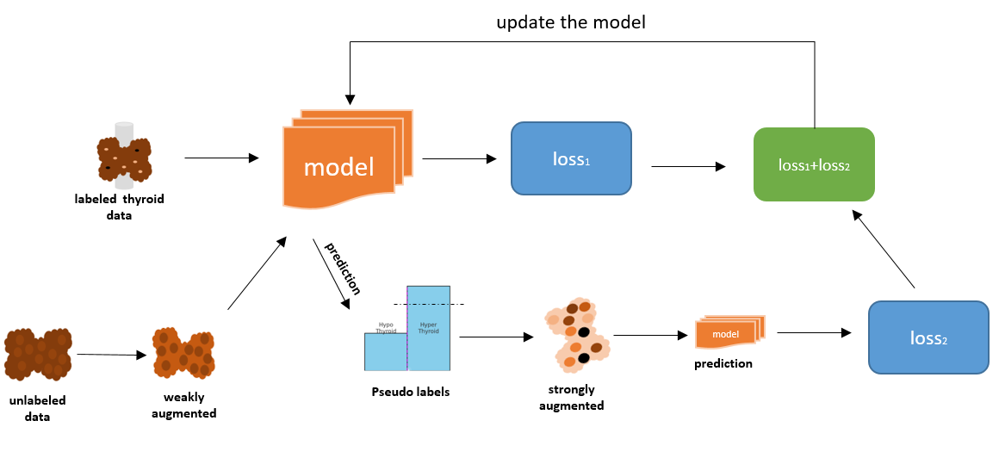

 

# Machine Learning Seemi-supervised Learning Classification Project

 
## Overview
This project implements machine learning models (FixMatch (mainFixMatch) and self-training (self_training)) for classification using TensorFlow and pandas in Python. The focus is on handling imbalanced datasets with labeled and unlabeled data, using techniques like undersampling and custom data augmentation.

## Features
- **Data Processing**: Utilizes pandas for data manipulation and sklearn for splitting the dataset.
- **Modeling**: Builds a neural network using TensorFlow for the classification task.
- **Data Augmentation**: Implements weak and strong augmentation techniques for unlabeled data.
- **Evaluation**: Includes metrics like Precision, Recall, F1-Score, etc., for model evaluation.

## Requirements
- TensorFlow
- Pandas
- Scikit-Learn
- NumPy

## Usage
1. Load your data: Modify the data loading section to include your labeled and unlabeled datasets.
2. Configure the model: Adjust hyperparameters and model architecture as needed.
3. Train the model: Run the training loop, which includes both labeled and unlabeled data processing.
4. Evaluate the model: Assess the model's performance on the test set.

## Contribution
Feel free to fork this project and contribute. Any enhancements or bug fixes are highly appreciated!
melih_agraz@brown.edu

---

 
